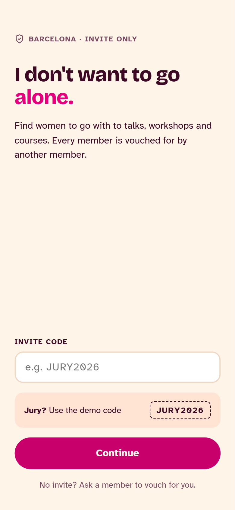
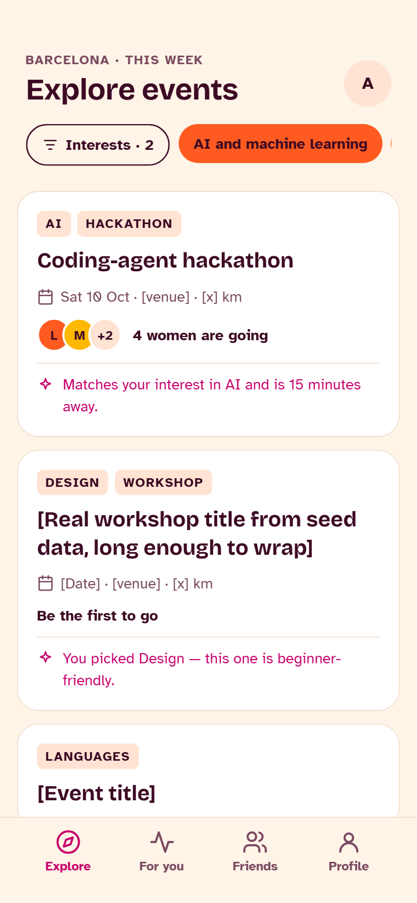
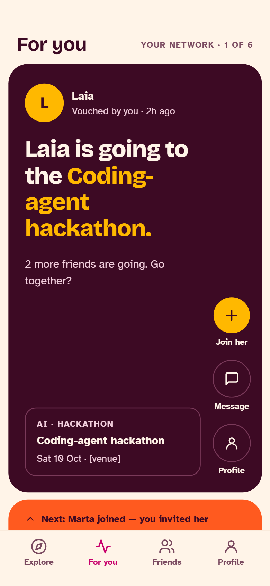
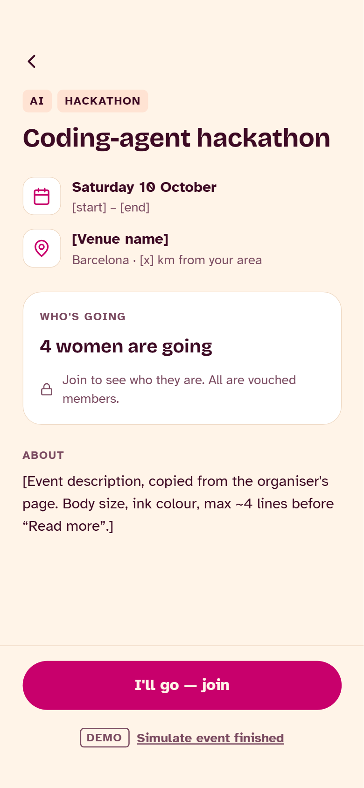
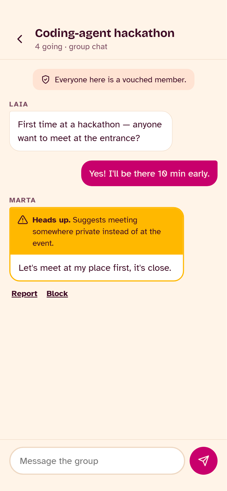
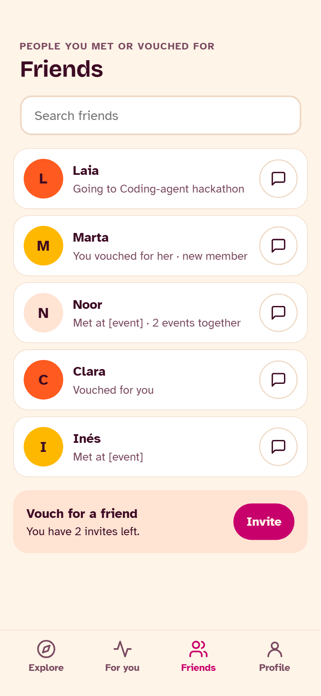

# I Don't Want to Go Alone

A mobile-first web app where women in Barcelona find other women to go with to learning
events (talks, workshops, courses). Entry is invite-only: every member is vouched for by an
existing member. AI recommends events and flags risky chat messages.

**Jury demo code: `JURY2026`**

See [PROJECT_GUIDE.md](PROJECT_GUIDE.md) for the product rules, data model and API contracts.

## What the app does

Many women skip talks, workshops and courses because they would have to walk in alone.
*I Don't Want to Go Alone* removes that barrier: you see which women you know, or were
vouched for by, are going, and you can go together.

- **Invite-only community.** You join with a code from an existing member, so every profile
  shows who vouched for her. Each member can vouch for 3 friends.
- **Explore events.** An AI-ranked feed of talks, workshops, courses, hackathons and meetups,
  with friend avatars on each card and a filter by interest.
- **For you.** One card at a time showing what your network is up to: friends going to events
  and new members.
- **Go together.** Join an event to see who else is going, then chat with the group in a
  realtime event chat, or message a connected member directly.
- **Publish events.** Members can add their own meetup ideas or external workshops they want
  company for.
- **Friends and profiles.** Connect with members from their profile, search your network and
  see who vouched for whom.
- **Safety built in.** AI flags risky chat messages with a visible category and reason; block
  and report are one tap away; after an event you can privately rate whether you'd go with her
  again.

## Tech stack

| Layer | Technology |
|---|---|
| Frontend | React 19 (JSX), Vite 8, React Router, Tailwind CSS 4, lucide-react icons |
| Backend | Supabase: Postgres, Auth, Row Level Security and Realtime for chat |
| AI | Vercel serverless functions (`/api/recommend`, `/api/moderate`) calling Google Gemini (free tier) or Anthropic Claude |
| Hosting | Vercel |
| Tooling | npm, oxlint |

Without Supabase credentials the app runs on mock data stored in the browser, so it works
out of the box.

## Prototype screenshots

> Add the images listed below to [`docs/screenshots/`](docs/screenshots/) with these file names.

| Welcome and invite code | Explore | For you |
|---|---|---|
|  |  |  |

| Event detail | Event chat | Friends |
|---|---|---|
|  |  |  |

| Member profile | Rating | Profile |
|---|---|---|
|  |  |  |

## Accounts, access and ratings

**Accounts**
- Onboarding adds a "Your login" step (username, password, repeat); sign-in asks for both.
- Supabase Auth holds passwords; usernames map to hidden `<username>@members.idwtga.app` logins.
- The session follows the Supabase Auth session; signing out ends it.
- Mock mode keeps salted password hashes in the browser's mock database.

**Access rules** ([`supabase/migrations/003_auth.sql`](supabase/migrations/003_auth.sql))
- Replace the open "demo anon access" policies with rules for signed-in members acting as themselves.
- Chat is only for attendees; DMs are only between friends and never across a block.
- Only the flag columns of `messages` can be updated; reports are write-only.
- Server functions: `check_invite`, `username_available`, `join_with_invite`, `member_rating`.

**Star ratings** ([`supabase/migrations/002_star_ratings.sql`](supabase/migrations/002_star_ratings.sql))
- "How was going to this event with her?" is rated 1–5 stars, anonymously.
- Rating opens after the event ends (a demo button skips the wait).
- The average is shown on profiles only once she has 3 ratings; the seed includes demo ratings.

## Run locally

```bash
npm install
npm run dev
```

Without any environment variables the app runs on **mock data** stored in your browser
(Profile → *Reset demo data* starts over). Chat messages are shared live between tabs of the
same browser, so two tabs signed in as different members can talk.

`npm run dev` does not serve `/api`, so AI features fall back: the feed is sorted by shared
interests and distance, and new chat messages aren't checked. To run the AI locally:

```bash
npx vercel dev
```

## Environment variables

Copy `.env.example` to `.env.local`.

| Variable | Where | Purpose |
|---|---|---|
| `VITE_SUPABASE_URL` | browser | Supabase project URL |
| `VITE_SUPABASE_ANON_KEY` | browser | Supabase anon key |
| `GEMINI_API_KEY` | `/api` only | Google Gemini key (free tier, from aistudio.google.com). **Never prefix with `VITE_`.** |
| `ANTHROPIC_API_KEY` | `/api` only | Alternative: Claude key (paid). Set one of the two AI keys. |
| `GEMINI_MODEL` / `ANTHROPIC_MODEL` | `/api` only | Optional. Defaults: `gemini-3.5-flash-lite` / `claude-haiku-4-5`. |
| `AI_PROVIDER` | `/api` only | Optional: `gemini` or `anthropic`, only if both keys are set. |

## Set up Supabase

1. Create a project at supabase.com.
2. **Authentication → Sign In / Providers → Email:** turn **off** "Confirm email". Members sign in
   with a username; it is stored as a hidden `<username>@members.idwtga.app` address and no email
   is ever sent.
3. In the SQL editor, run [`supabase/schema.sql`](supabase/schema.sql), then
   [`supabase/migrations/003_auth.sql`](supabase/migrations/003_auth.sql), then [`supabase/seed.sql`](supabase/seed.sql).
4. Put the project URL and anon key in `.env.local` (and in Vercel).

**Already have a database from an earlier version?** Run the migrations you haven't run yet, in
order, then `seed.sql` again:

| File | Adds |
|---|---|
| [`001_figma_handoff.sql`](supabase/migrations/001_figma_handoff.sql) | Event formats and end times, `direct_messages`, new interest names |
| [`002_star_ratings.sql`](supabase/migrations/002_star_ratings.sql) | 1–5 star ratings |
| [`003_auth.sql`](supabase/migrations/003_auth.sql) | Username + password accounts and per-member access rules |

`seed.sql` is generated from `src/mocks`. After changing the mocks, run `npm run seed:sql`.

**Security.** Members sign in with a username and password through Supabase Auth; passwords
never touch the app's tables. Access rules (`003_auth.sql`) let each member act only as herself:
post only in chats of events she joined, message only friends, see only her own blocks, invites
and given ratings. Star averages and invite checks run in server-side functions. Visitors who
aren't signed in can't read any table. Known limits: the AI safety check runs in the sender's
browser (it can only ever add a flag), and passwords can't be reset yet. Demo members from
`seed.sql` have no login.

## Deploy to Vercel

1. Import the repo in Vercel (framework preset: Vite).
2. Add `VITE_SUPABASE_URL`, `VITE_SUPABASE_ANON_KEY` and one AI key.
3. Deploy. `vercel.json` sends every non-`/api` path to the app so links like `/events/…` work on reload.

`/api/recommend` and `/api/moderate` are public endpoints: if you use a paid key, set a
monthly spend limit on that account.

## Before every commit

```bash
npm run lint
npm run build
```
